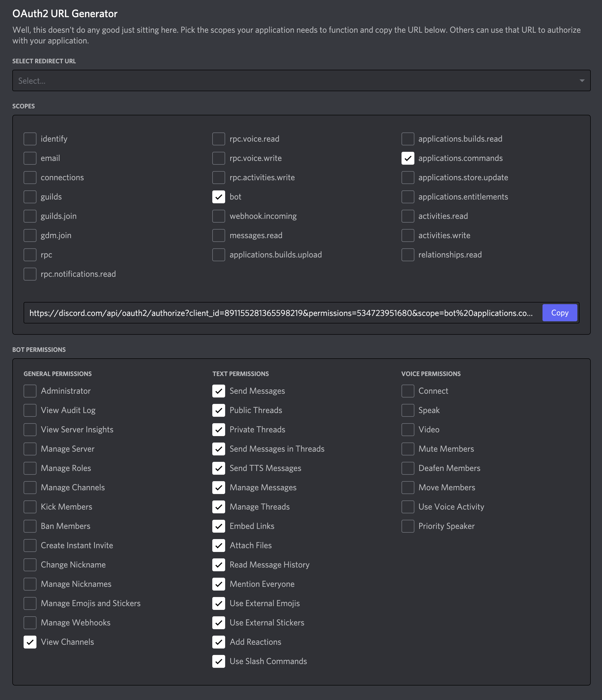
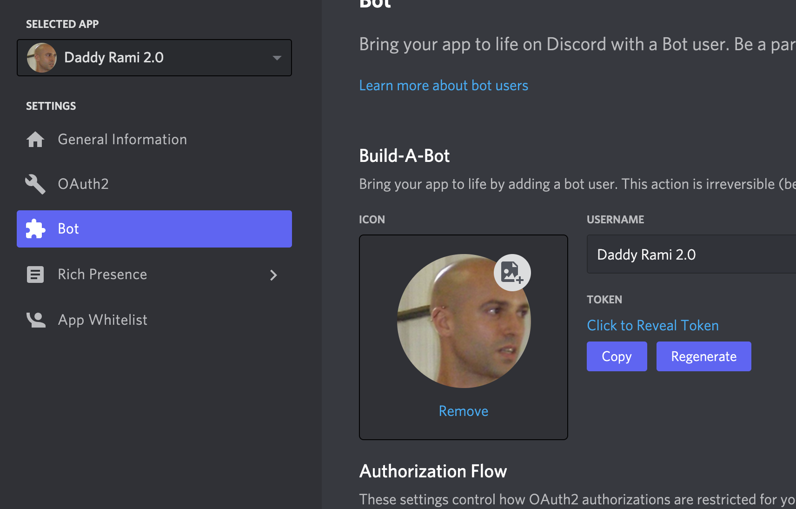

# UWA Bootcamp Discord Bot

## What this is.
This is the most recent iteration of the Daddy Rami Bot. I encourage all to help develop it and work on new features. This is for of the original project created by @Au-Rizer & @RitzGL. The original files have been archived out to the oldFiles dir. Developing on a communal bot can be a bit hard to pull off. I suggest that for anybody wanting to contribute or play with the code to create their own test server and bot and use the code from this repo to power it. This will allow you to work on the bot simultaneously in your own sandbox. This copy of the bot is hosted on DigitalOcean and I will setup the repo to push master to prod on merge.

## How to contribute?
### Get a Local Dev Environment setup
Steps to setup a local instance of the bot to start development.
1. Clone this repo and `npm install`
2. Create your own testing server.
Hit the plus sign under the channels in discord and call it 'My Test Server'.
3. Create an application / bot using this guide: https://discordjs.guide/preparations/setting-up-a-bot-application.html#creating-your-bot Call it `Daddy Rami 2.0`
4. Link the bot to your server:
- On your bot page in discord dev portal generate the OAuth2 URL with the following settings:

- Hit copy link and paste into your browser in a new tab
- Select the 'My Test Server' and click Continue
- You should be able to see the bot in your server. It will appear offline, that is okay.

5. Create an `.env` file at the top level of your project with the following structure:
```
TOKEN=1234321423142413.sdfgjsdgjkdsfgknsdg
CLIENT_ID=54654456546
GUILD_ID=45645654654654
```
Replace the above with the correct values for your instance:\
`TOKEN` : comes from the Bot page under settings of the app/bot you made. Copy and paste into `.env`
\
**For the next two settings you will need to make sure you have Developer Mode on in Discord. Open preferences -> Advanced and tick Developer Mode**\
`CLIENT_ID` : right click on the bot's icon in your 'My Test Server' click copy ID, paste into `.env`\
`GUILD_ID` : right click on your 'My Test Server' in the servers area and click copy ID paste into `.env`

6. You should be able to now run `npm run localDev` and your local copy/version of the bot will be running in your test server. You can test it by typing the `/ping` command in the general channel. The bot should respond with pong!

### Build a feature out
1. Create a feature branch. Try and make the feature small so we don't have branches out hanging for too long.
2. Put on some DnB, your favorite hoody, change the terminal to green and kill the lights. #hackertime
3. Try and commit often!
4. Push the branch up to github **after** you have rebased.
5. Open a PR.
6. Once the PR is reviewed and merged your feature will be in the prod version of the bot on the UWA server.
